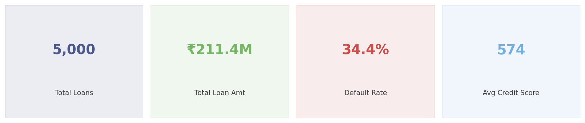
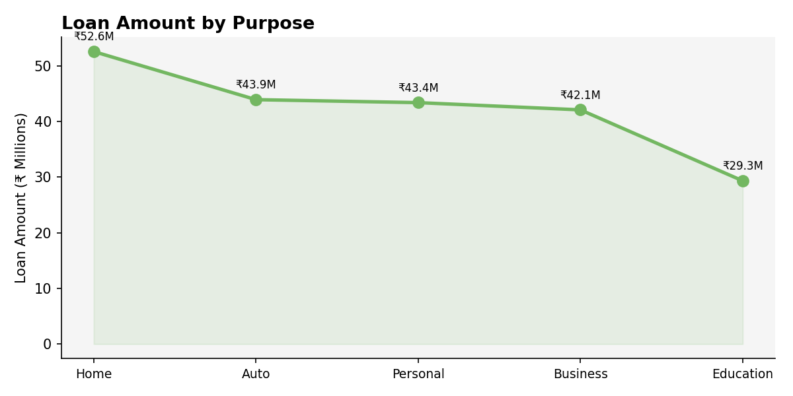
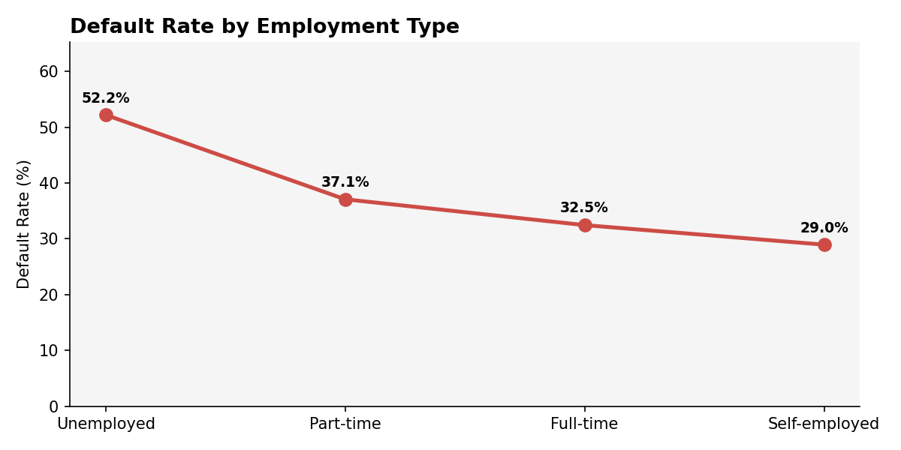
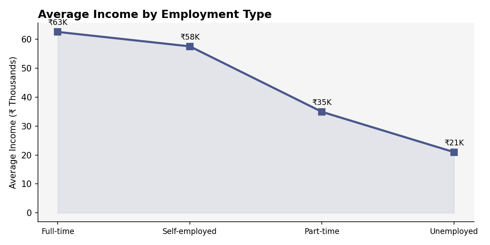
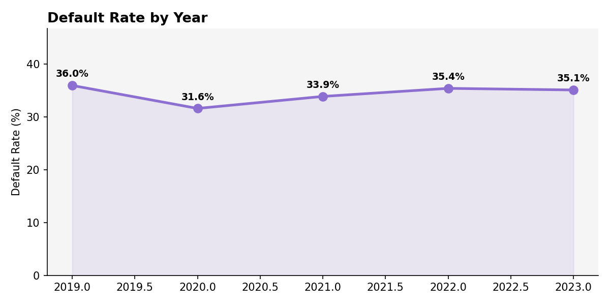
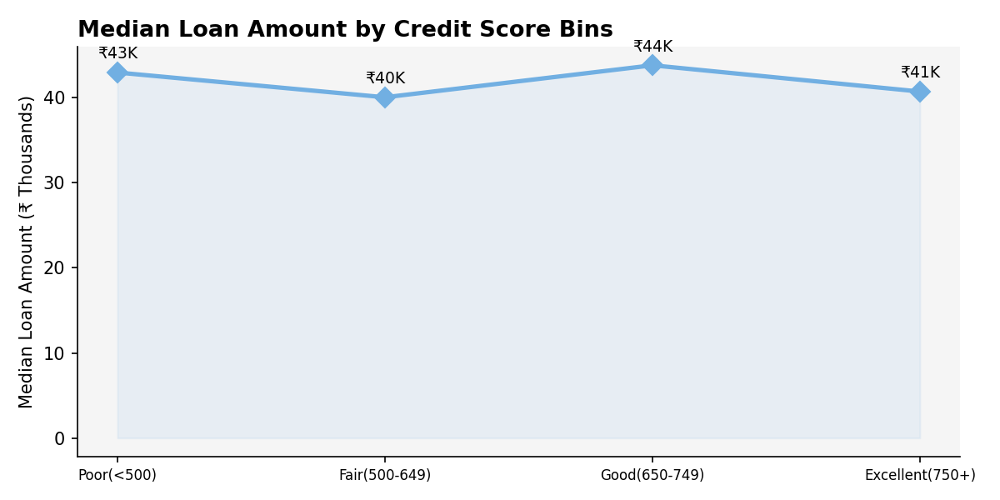
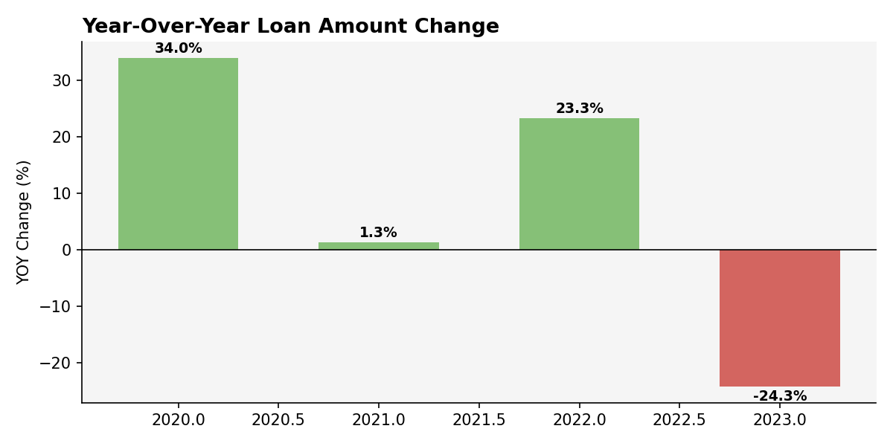
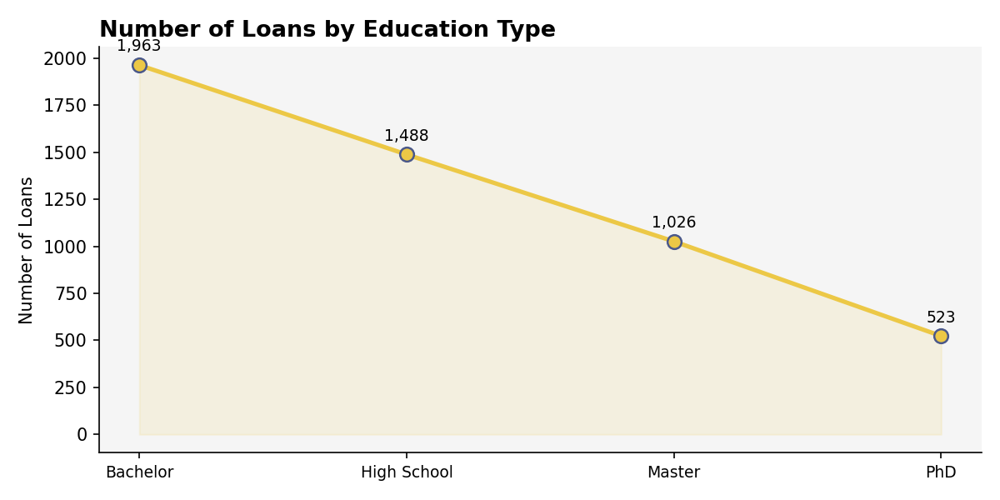
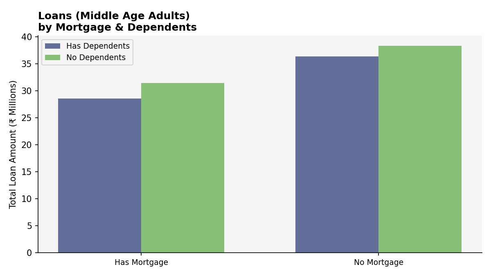

# Loan Default Analysis – Power BI Dashboard

An advanced Power BI project analyzing loan default patterns across 5,000+ loan records to help financial institutions identify high-risk borrowers, understand default drivers, and track year-over-year lending trends using time intelligence DAX measures.

## 📊 Project Overview

This dashboard covers three analytical perspectives — **Loan & Default Overview**, **Applicant Demographic & Financial Profile**, and a **Financial Risk Matrix** — using 13 custom DAX measures including YOY change, YTD totals, and median calculations across credit score bins, age groups, and employment types.

## 📁 Files in this Repository

| File | Description |
|---|---|
| `Loan_Default_Analysis.pbix` | Power BI report — open in Power BI Desktop for the full interactive dashboard |
| `images/` | Dashboard chart exports |

## 🗂️ Dataset

**Key fields in `Loan_default` table:**

| Field | Description |
|---|---|
| `LoanAmount` | Total loan value issued |
| `LoanPurpose` | Home / Auto / Education / Business / Personal |
| `EmploymentType` | Full-time / Part-time / Self-employed / Unemployed |
| `MaritalStatus` | Single / Married / Divorced |
| `HasMortgage` | Whether borrower has an existing mortgage |
| `HasDependents` | Whether borrower has dependents |
| `EducationType` | High School / Bachelor / Master / PhD |
| `CreditScore` | Raw credit score (300–850) |
| `Income` | Annual income |
| `Year` | Loan issue year |
| `Default` | 1 = Defaulted, 0 = Not Defaulted |

### Calculated Columns Built in Power BI
| Column | Logic |
|---|---|
| `Age Groups` | 18–29 / 30–44 / 45–59 / 60+ |
| `Credit Score bins` | Poor (<500) / Fair (500–649) / Good (650–749) / Excellent (750+) |
| `Income Bracket` | Low / Medium / High |
| `Year` | Extracted from loan date |

## 📐 DAX Measures (13 Total)

### Page 1 — Loan & Default Overview
- `Loan Amount by Purpose` — total loan value per purpose category
- `Average Income by Employment Type` — avg income segmented by employment
- `Default Rate for Employment Type` — % of defaults per employment type
- `Average Loan by Group` — avg loan amount per age group
- `Default Rate by Year` — yearly default rate trend

### Page 2 — Applicant Demographic & Financial Profile
- `Median by Credit Score bins` — median loan amount per credit tier
- `Average loan Amt (High Credit)` — avg loan for high credit score borrowers only
- `Total Loan (Credit bins)` — total loan volume per credit tier
- `Total Loan (Middle Age Adults)` — total loans for 30–59 age group
- `Loans by Education Type` — count of loans per education level

### Page 3 — Financial Risk Matrix
- `YOY Loan Amount Change` — year-over-year % change in loan volume
- `YOY Default Loans Change` — year-over-year % change in defaults
- `YTD Loan Amount` — year-to-date running total of loan amount

## 📈 Dashboard Pages

**Page 1 — Loan & Default Overview**
- Line chart: Loan Amount by Purpose
- Line chart: Average Income by Employment Type
- Line chart: Default Rate by Employment Type
- Line chart: Average Loan Amount by Age Group
- Line chart: Default Rate by Year

**Page 2 — Applicant Demographic & Financial Profile**
- KPI Card: Median Credit Score
- Line chart: Median Loan Amount by Credit Score Bins
- Donut chart: Average Loan Amount (High Credit) by Marital Status & Age Group
- Line chart: Total Loans (Adults) by Credit Score Bins
- Clustered Column chart: Loans (Middle Age Adults) by Mortgage & Dependents
- Line chart: Number of Loans by Education Type

**Page 3 — Financial Risk Matrix**
- Line chart: YOY Loan Amount Change
- Line chart: YOY Default Loans Change
- Ribbon chart: YTD Loan Amount by Credit Score Bins & Marital Status
- Decomposition Tree: Loan Amount broken down by Income Bracket → Employment Type

## 🖼️ Dashboard Visuals

**KPI Summary**

**Loan Amount by Purpose**

**Default Rate by Employment Type**

**Average Income by Employment Type**

**Default Rate by Year**

**Median Loan Amount by Credit Score Bins**

**Year-Over-Year Loan Amount Change**

**Number of Loans by Education Type**

**Loans (Middle Age Adults) by Mortgage & Dependents**

## 🔍 Key Insights

- **34.4% overall default rate** — more than 1 in 3 borrowers defaulted
- **Unemployed borrowers** have the highest default rate at **52.2%** — nearly double Self-employed (29.0%)
- **Home loans** generate the highest total volume, but **Personal & Business loans** carry higher default risk
- **Credit score is not strongly correlated with loan amount** — lenders are issuing similar loan sizes across all credit tiers, which is a lending risk
- **YOY loan volume grew 34% from 2020 to 2022** before declining in 2023
- **Middle-age adults (30–59) with both mortgage and dependents** take significantly larger loans — highest financial burden segment
- **Bachelor degree holders** take the most loans — nearly 2x PhD holders

## 🛠️ Tools Used

- **Power BI Desktop** — data modeling, DAX, time intelligence, report design
- **DAX** — 13 custom measures including YOY %, YTD, Median, filtered aggregations
- **CityPark theme** — applied built-in Power BI theme for consistent visual styling

## 🚀 How to Use

1. Clone or download this repository
2. Open `Loan_Default_Analysis.pbix` in [Power BI Desktop](https://powerbi.microsoft.com/desktop/) (free)
3. Navigate between the 3 pages using tabs at the bottom
4. Use the visual filters (Employment Type, Credit Score, Year) to drill into specific segments

## 📌 Future Improvements

- Add a **Loan Approval Score** model — combine credit, income, employment to predict default probability
- Add a **map visual** for regional default rate analysis
- Connect to SQL database for live data refresh
- Publish to Power BI Service for a shareable live link

---

*This project uses a synthetic loan dataset for analytical and portfolio purposes.*
